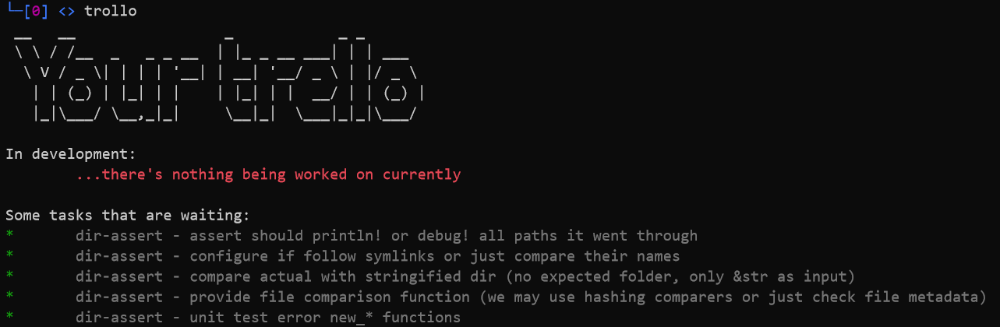

## Trollo

Trello *client* with focus on delivering quick summary on what's in progress and what needs to be done from several trello boards.

I assumed a specific format in all my trello projects, which allows me to group all of them and display tickets from each in nice and uniform way. In order for this to work for you you must:
* Have column named **"To Do"** with items that you have planned for each of your project
* Have column **"In Progress"** with items that you are actively working on

Client requires you to setup two environment variables:
* TRELLO_KEY
* TRELLO_TOKEN  
you can acquire both from trello website
